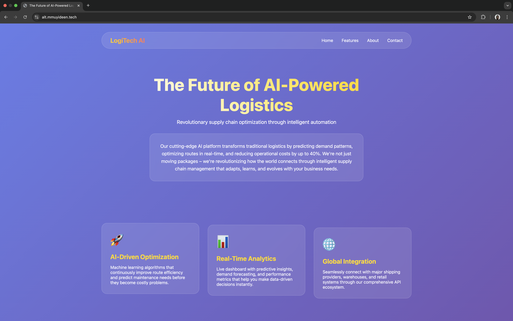

# Startup Landing Page

## Project Overview
This project is a dynamic prototype of a web application designed to showcase innovative startup ideas. It features a personalized landing page that highlights the project title, a short pitch, and a professional bio. The application is built using Node.js with Express and EJS for templating, and it is deployed on an Ubuntu server with Nginx as the web server.


## Server Provisioning
- The server is provisioned using [AWS EC2](https://aws.amazon.com/ec2/) with an Ubuntu distribution.
- This can be done using the AWS console, CLI or IAC tool like Terraform or Cloud Formation

## Networking & Security
- The application allows HTTP (Port 80) and HTTPS (Port 443) traffic at the instance level using Security Group.
- SSL is secured using Let's Encrypt certificate, configured in the Nginx settings.


## Web Server Setup
- Nginx is installed as the web server.
- The configuration file is located at `nginx/default.conf`, which includes settings for reverse proxying and handling HTTP/HTTPS requests.


## Deployment Instructions
1. Install Necessary dependencies.
   ```bash
   sudo apt update && sudo apt upgrade -y
   sudo apt install nodejs -y
   sudo apt install npm -y
   sudo apt install  -y nginx
   ```
2. Configure Nginx to proxy the server
   ```bash
   sudo nano /etc/nginx/sites-available/default 
   ```
   Add "proxy_pass http://localhost:3000;" to the location block &
   Reload nginx 
   ```bash
   sudo nginx -t
   sudo systemctl reload nginx
   ```
3. Configure SSL cert by installing Certbot and create DNS A record mspping Server Ipp to hostname
   ```bash
   sudo apt install -y certbot python3-certbot-nginx 
   sudo certbot --nginx -d alt.mmuyideen.tech
   ```

4. Clone the Repository
   ```bash
   git clone https://github.com/MMuyideen/altsch-secondsem-exam.git
   cd altsch-secondsem-exam/ 
   ```

5. Run the Application
   ```bash
   nohup node app.js & #make the appliocation run in background
   ```

## Screenshot
-  